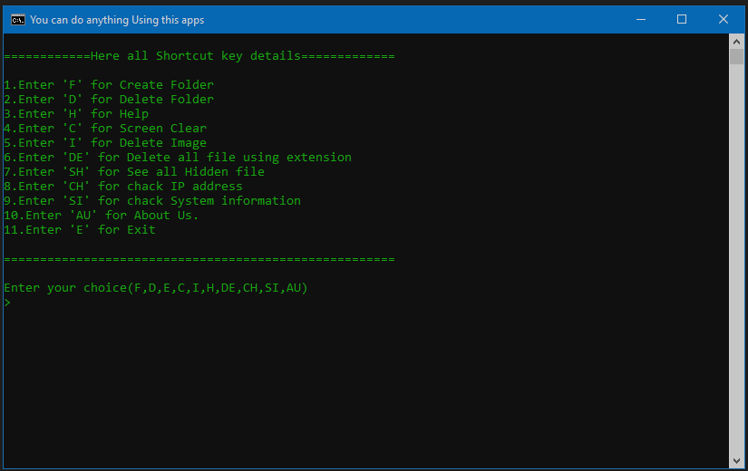

# ToolsMk make this using batch file programming 

---
## Which features given in this tools see below:
---

- [x] You can See any Hidden file
- [x] by one click Delete all file using extension
- [x] chack IP address
- [x] chack System information
- [x] Create Folder
- [x] Delete Folder
- [x] Screen Clear on cmd
- [x] Delete Image given image name
- [x] Exit



```
<b>Warning:</b> Please backup your file before try or applying or use this tool.
If any file delete for your mistakes it's not our responsibility. We are not responsible .
Do not use to harm anyone.
```
